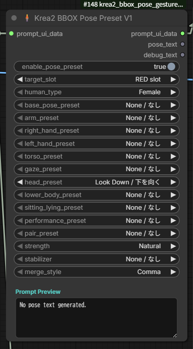

# custom_nodes-krea2_bbox_pose

Krea2 BBOX Prompter Suite向けの、ポーズ補助ノードです。BBOX Prompterの `prompt_ui_data` に接続し、選択したポーズ文を対象スロットのプロンプトへ追加します。

## 更新内容
- 2026-07-11: 操作項目を身体の流れに沿った5段の折りたたみUIへ整理し、座りと寝そべりを独立した選択欄へ分けました。
- `Prompt Preview` の高さ保存、ノード高さの自動追従、プリセット読込の再試行を追加しました。
- ピンアップ・モデル系を含む寝そべりプリセットを合計10種追加しました。

## 簡単な使い方
1. `Krea2 BBOX Prompter` の `prompt_ui_data` をこのノードへ接続します。
2. `target_slot` で反映先を選びます。通常は `RED slot` など明示指定が分かりやすいです。
3. 必要なプリセットを1つ、または矛盾しない範囲で複数選びます。
4. 下部の `Prompt Preview` で出力予定の自然文を確認します。
5. 後段へ `prompt_ui_data` をつなぎます。

## 各セクション
- `Basic / 基本設定`: 有効化、対象スロット、人物タイプ。
- `Whole Body / 全体ポーズ`: 基本姿勢、定型ポーズ、座り、寝そべり、2人用ポーズ。
- `Body / 身体調整`: 胴体、下半身、両手・腕まわりの調整。
- `Hands & Direction / 手・方向`: 左右の手、頭・首の向き、視線方向。
- `Advanced / 詳細設定`: 強さ、スタビライザー、結合方法。

各セクションは見出しを押して開閉できます。開閉状態はワークフローに保存されます。

## 設定
- `Strength`
  - `Natural`: そのまま追加。
  - `Clear`: `clear pose` を追加。
  - `Strong`: `clear intentional pose` と `pose clearly visible` を追加。
- `Stabilizer`
  - 補助文を追加して、手・全身・2人構図の安定を狙います。
  - 迷う場合は `None / なし` または `Any / 自動`。
- `Merge Style`
  - `Comma`: カンマで追加。通常推奨。
  - `Sentence`: 文として追加。
  - `New line`: 改行で追加。

## 追加サイン
- 指サイン: `L Sign`, `W Sign`, `I Sign`
- 全身サイン: `T Sign`, `Y Sign`, `X Sign`, `O Sign`
- 腕サイン: `Heart Arms`

<!-- PRESET_LIST_START -->
## プリセット一覧（プロンプトなし）

README上で確認しやすいように、プリセット名だけを掲載しています。実際に出力されるプロンプト本文は載せていません。

### Base Pose (18)
- Neutral Standing / 自然立ち
- Relaxed Standing / リラックス立ち
- Weight on One Leg / 片足重心
- One Leg Forward / 片足を前
- Natural Walking / 自然に歩く
- Hands on Hips Full Body / 腰に手で立つ
- Demure Standing / 控えめ立ち
- Soft Side Turn / 柔らかい斜め立ち
- Small Step Pose / 小さく一歩
- Small Bag Holding Stance / 小物を持つ立ち
- S-Curve Standing / S字立ち
- Walking Turn / 歩きながら振り向く
- Leaning Against Wall / 壁にもたれる
- Side Profile Standing / 横向き立ち
- Hero Stance / ヒーロー立ち
- Slight Forward Lean Full Body / 前傾立ち
- Crossed Legs Standing / 脚をクロスして立つ
- Reaching Forward / 手を伸ばす

### Hands Preset (45)
- Both Hands Behind Head / 両手を頭の後ろ
- Both Arms Raised / 両腕を上げる
- Hands Near Chest / 胸元に手
- Both Hands on Waist / 両手を腰に
- Both Hands on Hips / 両手を腰に
- Hands on Knees / 膝に両手
- Hands on Thighs / 太ももに両手
- Arms Around Knees / 膝を抱える
- Hands Near Cheeks / ほっぺ横の手
- Prayer Hands / 合掌
- Hands Clasped Front / 前で手を組む
- Arms Crossed / 腕組み
- Arms Lightly Folded / 軽い腕組み
- Hands Behind Back / 両手を後ろ
- Hand Near Neck / 首元に手
- Relaxed Shoulders / 肩の力を抜く
- Covering Both Eyes / 両目を隠す
- Both Hands Behind Neck / 首の後ろに両手
- Arms Stretching Up / 伸びをする
- Both Hands on Chest / 胸に両手
- Hands Folded in Front / 体の前で手を組む
- One Hand Over the Other / 手を重ねる
- Hands Beside Legs / 座って脚の横に手
- Air Quotes / エアクオート
- Heart Arms / ハートアーム
- Two-Hand Heart / 両手ハート
- Cat Paw / 猫手
- Fingers Interlaced / 指を組む
- Hands Covering Lower Face / 両手で口元を隠す
- Mystical Hand Seal / 印を結ぶ
- Ninja-like Hand Seal / 忍者の印
- One Arm Across Body / 片腕を体の前
- Adjusting Collar / 襟を直す
- Adjusting Tie / ネクタイを直す
- Holding Sleeve / 袖を持つ
- Touching Shoulder / 肩に手
- One Shoulder Lowered / 片肩を下げる
- Jacket Over Shoulder / 上着を肩にかける
- Hand on Collarbone / 鎖骨に手
- Holding Skirt Edge / スカート裾を持つ
- Hand on Upper Arm / 二の腕に手
- Hands Gently in Front / 前で手をそろえる
- Elbows Close to Body / 肘を体に寄せる
- One Hand on Opposite Elbow / 反対の肘に手
- Hands in Pockets / 両手をポケット

### Right / Left Hand Preset (51)
- Peace Sign / ピース
- OK Sign / OKサイン
- Thumbs Up / 親指立て
- Open Palm / 手のひら
- Pointing Forward / 指差し
- Clenched Fist / 拳
- Stop Gesture / 止まれ
- Palm Up Presenting / 手のひらで見せる
- Shushing / しー
- Hand Near Mouth / 口元に手
- Covering Mouth / 口を隠す
- Touching Cheek / 頬に手
- Hand Under Chin / 顎に手
- Covering One Eye / 片目を隠す
- Brushing Hair Away / 髪を払う
- One Hand Behind Head / 片手を頭の後ろ
- One Arm Raised / 片腕を上げる
- One Hand on Chest / 胸に片手
- One Hand on Hip / 片手を腰に
- Beckoning / 手招き
- Waving / 手を振る
- Presenting Gesture / 差し出す
- Soft Small Wave / 小さく手を振る
- C Sign / Cサイン
- I Sign / Iサイン
- L Sign / Lサイン
- W Sign / Wサイン
- Crossed Fingers / クロスフィンガー
- Index and Little Finger / 人差し指と小指
- Loose Peace Sign / ラフなピース
- Hand Near Lips / 唇近くに手
- Supporting Cheek / 頬杖風
- Touching Chin / 顎を触る
- Hand Near Eye / 目元に手
- Partially Covering Face / 顔を少し隠す
- Touching Forehead / おでこに手
- Hand Near Ear / 耳元に手
- Hand on Top of Head / 頭に手
- Hand on Side of Head / 側頭部に手
- One Hand Behind Neck / 首の後ろに片手
- One Hand on Stomach / お腹に片手
- One Hand on Knee / 片膝に手
- One Hand on Thigh / 太ももに片手
- Hand on Shin / すねに手
- Small Beckoning / 小さな手招き
- Pointing to Self / 自分を指す
- Hand Toward Camera / 手を前へ
- Finger Heart / 指ハート
- Hand in Pocket / ポケットに手
- Heavy Carry / 重い荷物を持つ
- Heavy Bag Side / 重いバッグを横に持つ

### Torso Preset (13)
- Torso Twist / 上半身をひねる
- Forward Lean / 少し前かがみ
- Backward Arch / 少し反る
- Side Bend / 横に傾ける
- Shoulder Turn / 肩を回してひねる
- Open Chest / 胸を開く
- Hip Tilt / 腰を少し傾ける
- Soft S-Curve Torso / 上半身S字
- Deep Forward Bend / 深い前屈み
- Deep Back Arch / 大きく反る
- Strong Torso Twist / 大きくひねる
- Right Side Lean / 右へ大きく倒す
- Left Side Lean / 左へ大きく倒す

### Gaze Preset (15)
- Looking Back / 振り返り
- Back View Looking Back / 後ろ姿で振り返り
- Looking Over Shoulder / 肩越し視線
- Looking at Viewer / 正面を見る
- Looking Away / 視線を外す
- Looking Up / 上を見る
- Looking Down / 下を見る
- Looking to Side / 横を見る
- Looking Back Gaze / 振り返って見る
- Looking at Hand / 手を見る
- Looking at Object / 物を見る
- Looking at Another Person / 相手を見る
- Eyes Closed / 目を閉じる
- Looking Left / 左を見る
- Looking Right / 右を見る

### Head Preset (9)
- Head Facing Left / 顔を左へ
- Head Facing Right / 顔を右へ
- Head Facing Up / 顔を上へ
- Head Facing Down / 顔を下へ
- Head Tilt Left / 頭を左に傾ける
- Head Tilt Right / 頭を右に傾ける
- Chin Up / あごを上げる
- Chin Down / あごを下げる
- Head Lean Back / 頭を後ろへ反らす

### Lower Body Preset (32)
- One Knee Bent / 片膝を曲げる
- One Foot Forward / 片足を前へ
- Legs Together / 脚をそろえる
- Relaxed Foot Placement / 自然な足元
- Knees Slightly Inward / 内股ぎみ
- Tiptoe / つま先立ち
- Wide Stance / 足を広げる
- Side Step / 横ステップ
- One Knee Raised / 片膝を上げる
- Front Leg Lift / 脚を前に上げる
- Side Leg Lift / 脚を横に上げる
- Back Leg Lift / 脚を後ろに上げる
- Ballet Side Extension / 横へ大きく脚を伸ばす
- Wide Side Split Stance / 横に大きく開く
- Low Lunge / 低いランジ
- Side Lunge / サイドランジ
- High Kick Leg / 高く蹴り上げる
- Back Kick Leg / 後ろ蹴り
- Bent Leg Back / 膝を曲げて後ろへ
- Crossed Ankles / 足首をクロス
- Crossed Legs / 脚をクロス
- Knees Together Feet Apart / 膝を寄せて足先を開く
- Pointed Toe / つま先を伸ばす
- Heel Lift / かかとを上げる
- Toes Out Stance / つま先を外へ
- One Leg Balance / 片足バランス
- Long Step Back / 片足を後ろへ引く
- Front Split / 前後開脚
- Side Split / 横開脚
- High Leg Extension / 脚を高く上げる
- Ballet Arabesque Legs / アラベスク脚
- Knee Lift Balance / 膝上げバランス

### Sitting Preset (27)
- Seiza / 正座
- Side Sitting / 横座り
- Hugging Knees / 膝を抱える
- Sitting Legs Together / 脚をそろえて座る
- Wariza / 割座
- Chair Crossed Legs / 椅子で脚を組む
- Sitting on Chair Edge / 椅子に浅く座る
- Legs Angled to Side / 脚を斜めに流す
- One Hand Beside on Floor / 床に片手
- Kneeling on One Knee / 片膝立ち
- Crouching / しゃがむ
- Cross-Legged Floor Sitting / あぐら座り
- Lotus Sitting / 蓮華座風
- One Knee Up Sitting / 片膝を立てて座る
- Both Knees Up Sitting / 両膝を立てて座る
- One Leg Folded One Extended / 片脚を伸ばして座る
- Perched Sitting / 端に軽く座る
- Kneeling on Both Knees / 両膝立ち
- Deep Squat / 深いしゃがみ
- Street Squat / ストリートしゃがみ
- Low Lunge Kneel / 低い片膝ランジ
- Kneel Leg Back / 片膝で後ろ脚伸ばし
- Sitting Backwards / 後ろ向き座り
- Butterfly Sitting / バタフライ座り
- Legs Forward Sitting / 足を前に投げ出す
- Casual Floor Sitting / ラフな床座り
- Back Lean Sitting / 後ろ手にもたれる座り

### Lying Preset (19)
- Lying on Stomach / うつ伏せ
- Lying on Side / 横向き寝そべり
- Lying on Back / 仰向け
- Relaxed Side Lying / 横向きでリラックス
- Reclining Upper Body / 上体起こし寝そべり
- Raised Side Lying / 上体起こし横向き寝
- One Knee Bent Lying / 片膝立て仰向け
- Curled Side Lying / 丸まり横向き寝
- Legs Raised Lying / 脚上げ寝そべり
- Prone Knees Bent / うつ伏せ両膝曲げ
- Supine Knees Raised / 仰向け両膝立て
- Side Legs Extended / 横向き脚伸ばし
- Ankles Crossed Lying / 足首クロス仰向け
- Diagonal Reclining / 斜め寝そべり
- Pin-up Knee Drop / ピンアップ膝倒し
- Pin-up Back Arch / ピンアップ仰向け反り
- Mermaid Side Recline / マーメイド横寝
- Prone Crossed Ankles / うつ伏せ足首クロス
- Pin-up Hip Twist / ピンアップ腰ひねり

### Performance Preset (59)
- Bowing / お辞儀
- Hip-Hop Hand to Camera / 手を前へ
- Hip-Hop Both Hands Near Chest / 胸元で両手
- Hip-Hop Loose Peace / ラフなピース
- Hip-Hop Arms Wide / 腕を広げる
- Hip-Hop Lean Gesture / 傾けてサイン
- Dance One Arm Raised / 片腕ダンス
- Dance Arms Spread / 両腕ダンス
- Spinning Dance / ターン
- Rhythmic Step / ステップ
- Extended Fingers Dance / 指先まで伸ばす
- Holding Kimono Sleeve / 袖を押さえる
- Holding Folding Fan / 扇子を持つ
- Formal Floor Greeting / 三つ指風
- Model S-Curve / モデルS字
- Fighting Stance / 戦闘構え
- Kung Fu Stance / カンフー構え
- High Kick / ハイキック
- Punch Pose / パンチポーズ
- Monkey Dance / モンキーダンス
- Kirara Jump / きららジャンプ
- Baseball Pitch / 野球投球
- Baseball Swing / 野球スイング
- Sumo Stance / 相撲構え
- Rugby Crouch / ラグビー構え
- Catwalk Walk / キャットウォーク
- Model Pose / モデル立ち
- Picking From Ground / 地面から拾う
- Deep Backbend / 大きく反る
- Bridge Pose / ブリッジ
- Handstand / 倒立
- Floor Reach / 床に手を伸ばす
- Backflip / バク転
- T Sign / Tサイン
- Y Sign / Yサイン
- X Sign / Xサイン
- O Sign / Oサイン
- Classic Pin-Up / 定番ピンアップ
- Hand on Hip Pin-Up / 腰に手ピンアップ
- Over Shoulder Pin-Up / 振り向きピンアップ
- One Leg Lift Pin-Up / 片脚上げピンアップ
- Seated Pin-Up / 座りピンアップ
- Back Leg Lift / 後ろ脚上げ
- Ballet Arabesque / アラベスク
- Ballet Attitude / アティチュード
- Ballet Second Position / 2番ポジション
- High Kick / ハイキック [dance_high_kick]
- Jump Pose / ジャンプ
- Martial Kick Pose / 格闘キック
- Performance Guitar Pose / ギターパフォーマンス
- Performance Mic Pose / マイクパフォーマンス
- Side Leg Extension / 横脚上げ
- Split Pose / 開脚ポーズ
- Stage Finish Pose / 決めポーズ
- Breakdance Floor Support / 床に手をつく
- Breakdance Freeze / フリーズ
- Headstand Pose / 頭倒立
- Back Spin Pose / 背中で回る
- Hero Landing / ヒーロー着地

### Pair Preset (22)
- Face to Face / 向かい合う
- Back to Back / 背中合わせ
- Holding Hands / 手をつなぐ
- Arm Around Shoulder / 肩を抱く
- Bridal Carry / お姫様抱っこ
- Cheek to Cheek / 頬を寄せる
- Front Hug / 正面ハグ
- Guiding by the Hand / 手を取って導く
- Hand on Back / 背中に手
- Hand on Shoulder / 肩に手
- Hand on Waist / 腰に手
- Hug From Behind / 後ろからハグ
- Lap Pillow / 膝枕
- Side Hug / 横からハグ
- Touching Cheek / 頬に触れる
- Linking Arms / 腕を組む
- Shoulder to Shoulder / 肩を寄せる
- High Five / ハイタッチ
- Pulling by Hand / 手を引く
- Foreheads Touching / 額を合わせる
- Couple Arm Around / 肩を抱く
- Couple Leaning Close / 寄り添う

### Other Presets (1)
- Heavy Backpack / 重いリュック

<!-- PRESET_LIST_END -->

## 注意
- 強い全身ポーズは1つだけ選ぶ方が安定します。
- 手・腕系は比較的重ねやすいですが、左右や姿勢が矛盾しないようにしてください。
- `Sitting Preset` または `Lying Preset` と立ち姿・下半身系は競合しやすいため、選択時は基本姿勢と下半身指定を無視します。
- 座りと寝そべりを同時に選んだ場合は、矛盾防止のため `Lying Preset` を優先します。
- 古いワークフロー由来の `custom_add_on` は内部互換用で、通常UIには表示しません。

## 仕様
- 入力: `KREA2_ELEMENT_PROMPT_DATA`
- 出力: `prompt_ui_data`, `pose_text`, `debug_text`
- ノード下部の `Prompt Preview` は、ドロップダウン変更だけで即時更新されます。
- `Prompt Preview` の高さはワークフローに保存され、手動リサイズ時はノード高さも追従します。
- 折りたたみセクションの開閉状態もワークフローに保存されます。
- 旧 `Sitting / Lying Preset` の値は、新しい座り・寝そべり欄へ自動移行します。
- プリセット読込に失敗した場合は、短い待機後に1回だけ自動再試行します。
- プリセット一覧は `pose_gesture_presets.json` で管理します。
- Web UI用JSは `web/krea2_pose_gesture_live_preview.js` です。

## 手動導入
1. 古い同系フォルダを削除または退避します。
2. このフォルダを `ComfyUI/custom_nodes/` に入れます。
3. ComfyUIを再起動します。
4. ブラウザを `Ctrl + F5` で更新します。
